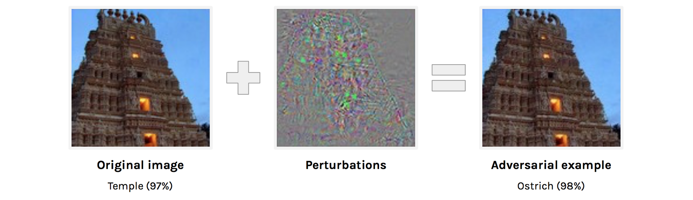
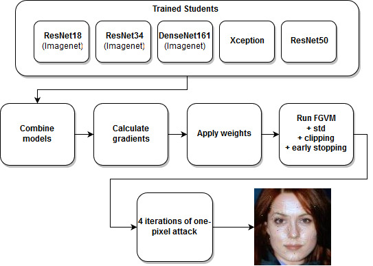
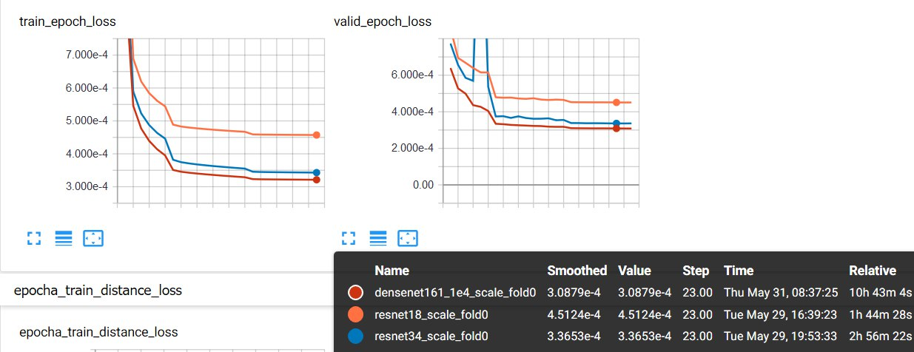

# 2nd place solution for MCS2018: [Adversarial Attacks on Black-box Face Recognition challenge](https://competitions.codalab.org/competitions/19090)



This code is based on [baseline code](https://github.com/AlexanderParkin/MCS2018.Baseline) provided by organizers.    
Solution authors: [@atmyre](https://github.com/atmyre), [@mortido](https://github.com/mortido), [@snakers4](https://github.com/snakers4), [@stalkermustang](https://github.com/stalkermustang)

### More info:
Our solution [presentation](https://drive.google.com/file/d/1P-4AdCqw81nOK79vU_m7IsCVzogdeSNq/view) at MCS2018  
Top-3 winners' [presentation](https://drive.google.com/file/d/1aIUSVFBHYabBRdolBRR-1RKhTMg-v-3f/view)  
Presentations at MCS2018 summit: [video](https://youtu.be/cSrc1gCOsTw?t=2h25m40s)  


## Table of contents:
<!--ts-->
   <!-- * [2nd place solution for MCS2018: <a href="https://competitions.codalab.org/competitions/19090" rel="nofollow">Adversarial Attacks on Black-box Face Recognition challenge</a>](#2nd-place-solution-for-mcs2018-adversarial-attacks-on-black-box-face-recognition-challenge) -->
   * [Solution overview](#solution-overview)
   * [How to reproduce](#how-to-reproduce)
      * [1. Set environment and get data](#1-set-environment-and-get-data)
      * [2. Download pre-trained weights](#2-download-pre-trained-weights)
      * [3. Run attack inference](#3-run-attack-inference)
      * [4. Make submission](#4-make-submission)
   <!--* [Train snakers41's CNNs (optional)](#train-snakers41s-cnns-optional)
      * [Prepare the data](#prepare-the-data)
      * [Train models](#train-models)
      * [Pre-trained weights](#pre-trained-weights)
      * [Training time](#training-time)-->
   * [Train mortido's CNNs (optional)](#train-mortidos-cnns-optional)
   * [Useful links](#useful-links)

<!-- Added by: atmyre, at:  -->

<!--te-->

# Solution overview
This code trains different white boxes on data from the black box model, makes iterations of [FGSM attacks](https://arxiv.org/pdf/1412.6572.pdf) with heuristics and genetic one-pixel attacks on the white boxes:<br/>


# How to reproduce

## 1. Set environment and get data 
You may use our dockerfile to build a docker container:
<details><summary>How to build docker container</summary>
<p>
To build the docker image from the Dockerfile located in `dockerfile` please do:
```
cd dockerfile
docker build -t face_attack_docker .
```

Also please make sure that [nvidia-docker2](https://github.com/nvidia/nvidia-docker/wiki/Installation-(version-2.0)) and proper nvidia drivers are installed.

To test the installation run
```
docker run --runtime=nvidia --rm nvidia/cuda nvidia-smi
```

Then launch the container as follows:
```
docker run --runtime=nvidia -e NVIDIA_VISIBLE_DEVICES=all -it -v /your/folder/:/home/keras/notebook/your_folder -p 8888:8888 -p 6006:6006 --name face_attack --shm-size 16G face_attack_docker
```

Please note that w/o `--shm-size 16G` PyTorch dataloader classes will not work.
The above command will start a container with a Jupyter notebook server available via port `8888`. 
Port `6006` is for tensorboard, if necessary.

Then you can exec into the container like this. All the scripts were run as root, but they must also work under user `keras`
```
docker exec -it --user root 46b9bd3fa3f8 /bin/bash
```
or
```
docker exec -it --user keras 46b9bd3fa3f8 /bin/bash
```

To find out the container ID run
```
 docker container ls
```
</p>
</details>

or download black box manually for your cuda-pytorch environment and put in into root of your folder with this repo:

|OS|python 2.7|python 3.5|python 3.6|
|:-------:|:-------:|:-------:|:-------:|
|Ubuntu| [CPU](http://mcs2018-competition.visionlabs.ru/distribs/ubuntu/MCS2018_CPU.so)<br/>[GPU(cuda8.0)](http://mcs2018-competition.visionlabs.ru/distribs/cuda8/ubuntu/MCS2018.so)<br/>[GPU(cuda9.0)](http://mcs2018-competition.visionlabs.ru/distribs/cuda9/ubuntu/MCS2018.so)<br/>[GPU(cuda9.1)](http://mcs2018-competition.visionlabs.ru/distribs/cuda9.1/ubuntu/MCS2018.so)<br/>[GPU(cuda9.2)](http://mcs2018-competition.visionlabs.ru/distribs/cuda9.2/ubuntu/MCS2018.so)| [CPU](http://mcs2018-competition.visionlabs.ru/distribs/ubuntu/MCS2018_CPU.cpython-35m-x86_64-linux-gnu.so)<br/>[GPU(cuda8.0)](http://mcs2018-competition.visionlabs.ru/distribs/cuda8/ubuntu/MCS2018.cpython-35m-x86_64-linux-gnu.so)<br/>[GPU(cuda9.0)](http://mcs2018-competition.visionlabs.ru/distribs/cuda9/ubuntu/MCS2018.cpython-35m-x86_64-linux-gnu.so)<br/>[GPU(cuda9.1)](http://mcs2018-competition.visionlabs.ru/distribs/cuda9.1/ubuntu/MCS2018.cpython-35m-x86_64-linux-gnu.so)<br/>[GPU(cuda9.2)](http://mcs2018-competition.visionlabs.ru/distribs/cuda9.2/ubuntu/MCS2018.cpython-35m-x86_64-linux-gnu.so) | [CPU](http://mcs2018-competition.visionlabs.ru/distribs/ubuntu/MCS2018_CPU.cpython-36m-x86_64-linux-gnu.so)<br/>[GPU(cuda8.0)](http://mcs2018-competition.visionlabs.ru/distribs/cuda8/ubuntu/MCS2018.cpython-36m-x86_64-linux-gnu.so)<br/>[GPU(cuda9.0)](http://mcs2018-competition.visionlabs.ru/distribs/cuda9/ubuntu/MCS2018.cpython-36m-x86_64-linux-gnu.so)<br/>[GPU(cuda9.1)](http://mcs2018-competition.visionlabs.ru/distribs/cuda9.1/ubuntu/MCS2018.cpython-36m-x86_64-linux-gnu.so)<br/>[GPU(cuda9.2)](http://mcs2018-competition.visionlabs.ru/distribs/cuda9.2/ubuntu/MCS2018.cpython-36m-x86_64-linux-gnu.so)|
|CentOS| [CPU](http://mcs2018-competition.visionlabs.ru/distribs/centos/MCS2018_CPU.so)<br/>[GPU (cuda8.0)](http://mcs2018-competition.visionlabs.ru/distribs/cuda8/centos/MCS2018.so) | [CPU](http://mcs2018-competition.visionlabs.ru/distribs/centos/MCS2018_CPU.cpython-35m-x86_64-linux-gnu.so)<br/>[GPU(cuda8.0)](http://mcs2018-competition.visionlabs.ru/distribs/cuda8/centos/MCS2018.cpython-35m-x86_64-linux-gnu.so)| [CPU](http://mcs2018-competition.visionlabs.ru/distribs/centos/MCS2018_CPU.cpython-36m-x86_64-linux-gnu.so)<br/>[GPU(cuda8.0)](http://mcs2018-competition.visionlabs.ru/distribs/cuda8/centos/MCS2018.cpython-36m-x86_64-linux-gnu.so)|
|Windows| [CPU](http://mcs2018-competition.visionlabs.ru/distribs/windows/MCS2018_CPU.pyd) | [CPU](http://mcs2018-competition.visionlabs.ru/distribs/windows/MCS2018_CPU.cp35-win_amd64.pyd) | [CPU](http://mcs2018-competition.visionlabs.ru/distribs/windows/MCS2018_CPU.cp36-win_amd64.pyd) |
|MacOS| [CPU](http://mcs2018-competition.visionlabs.ru/distribs/macos/MCS2018_CPU.so) | [CPU](http://mcs2018-competition.visionlabs.ru/distribs/macos/MCS2018_CPU.cpython-35m-darwin.so) | [CPU](http://mcs2018-competition.visionlabs.ru/distribs/macos/MCS2018_CPU.cpython-36m-darwin.so)

Download [pair's data](http://mcs2018-competition.visionlabs.ru/imgs.zip), [student_model_imgs](http://mcs2018-competition.visionlabs.ru/student_model_imgs.zip), [submit list](http://mcs2018-competition.visionlabs.ru/submit_list.csv), [pairs list](http://mcs2018-competition.visionlabs.ru/pairs_list.csv) and move to data:
```
python downloader.py --root ./data --main_imgs --student_model_imgs --submit_list --pairs_list
```
Prepare data for student model:
```
python prepare_data.py --root data/student_model_imgs/ --datalist_path data/datalist/ --datalist_type train --gpu_id 1;
python prepare_data.py --root data/imgs/ --datalist_path data/datalist/ --datalist_type val --gpu_id 1
```
## 2. Download pre-trained weights 
Download weights for 5 models and place them to student_net_learning/checkpoint/ :
- [DenseNet169](https://drive.google.com/open?id=1STT7CIKY8k3k_6RvRX1vop1HEF4A5EEP)
- [ResNet34](https://drive.google.com/open?id=17z5p02kBePmyzyPxdWaHyCb6CVHhMXbe)
- [ResNet18](https://drive.google.com/open?id=1K5zBBxYRzFDqPQqGQ15Lo4vjrexwVtM1)
- [ResNet50](https://drive.google.com/open?id=1dYp6mATDa8ObQVwu1HzHK6U6pzHn9sPz)
- [Xception](https://drive.google.com/open?id=1cVwP765K3DzTRzaEBr_fMf9bqjtYIz7w)

## 3. Run attack inference


**Run attack scripts using the above pre-trained weights, or proceed to training sections**


First attack using Fast Gradient Value Method

```
python attacker.py --root ./data/imgs/ --save_root ./dual_net_new/ --datalist ./data/pairs_list.csv --start_from 0 --attack_type IFGM \
--model_name resnet34 ResNet50 Xception resnet18 densenet161 \
--checkpoint \
student_net_learning/checkpoint/resnet34_scale_fold0_best.pth.tar \
student_net_learning/checkpoint/ResNet50/best_model_chkpt-resnet50.t7 \
student_net_learning/checkpoint/Xception/best_model_chkpt-xception.t7 \
student_net_learning/checkpoint/resnet18_scale_fold0_best.pth.tar \
student_net_learning/checkpoint/densenet161_1e4_scale_fold0_best.pth.tar --cuda
```
Please note that full inference may take 30+ hours, therefore the easiest way to speed up the script is to run it in several threads using `--start_from 0` parameter
Then run one instance of one-pixel attack
```
python attacker.py --root ./dual_net_new --save_root ./dual_net_new_op/ \
--datalist ./data/pairs_list.csv --cuda --start_from 0 --attack_mode continue --attack_type OnePixel --iter 16
```
Then run one more instance of one pixel attack
```
python attacker.py --root ./dual_net_new_op_15 --save_root ./FINAL_FINAL/ \
--datalist ./data/pairs_list.csv --cuda --start_from 0 --attack_mode continue --attack_type OnePixel-last-hope --iter 5
```

## 4. Make submission
Check ssim for submission, archive all files and make submission
```
python evaluate.py --attack_root ./FINAL_FINAL/ --target_dscr ./data/val_descriptors.npy --submit_name final_final --gpu_id 0
```

<!--# Train snakers41's CNNs (optional)

## Prepare the data
First `cd av_cnns`

Then make sure that the following files and folders are available via the following relative paths
- `./data/img_list_1M.csv` - list with 1M images
- `../data/img_descriptors_1M.npy` - numpy array with 1M descriptors
- `../data/student_model_imgs` - a folder with 1M images

## Train models

Then copy the following scripts one by one to a `run.sh` file and run `sh run.sh`
To view TensorBoard logs you need to enable TensorBoard via
```
tensorboard --logdir='path/to/av_cnns/tb_logs' --port=6006
```

The weights will be saved to `weights/`
Alternatively you can run all the scripts as one file

**Densenet**
```
python3 distill_network.py \
	--arch densenet161 --lognumber densenet161_1e4_scale \
	--epochs 25 --start-epoch 0 \
	--batch-size 256 --workers 10 \
	--val_size 0.1 --do_augs False \
	--lr 1e-4 --ths 1e-2 \
	--m1 5 --m2 15 \
	--optimizer adam --print-freq 10 \
	--tensorboard True \
```
**ResNet34**
```
python3 distill_network.py \
	--arch resnet18 --lognumber resnet18_scale \
	--epochs 25 --start-epoch 0 \
	--batch-size 512 --workers 10 \
	--val_size 0.1 --do_augs False \
	--lr 1e-3 --ths 1e-2 \
	--m1 5 --m2 15 \
	--optimizer adam --print-freq 10 \
	--tensorboard True \
```

**ResNet18**
```
python3 distill_network.py \
	--arch resnet34 --lognumber resnet34_scale \
	--epochs 25 --start-epoch 0 \
	--batch-size 512 --workers 10 \
	--val_size 0.1 --do_augs False \
	--lr 1e-3 --ths 1e-2 \
	--m1 5 --m2 15 \
	--optimizer adam --print-freq 10 \
	--tensorboard True \
```

## Pre-trained weights
To download the **pre-trained weights** you can use the following links:
- [DenseNet169](https://drive.google.com/open?id=1STT7CIKY8k3k_6RvRX1vop1HEF4A5EEP)
- [ResNet34](https://drive.google.com/open?id=17z5p02kBePmyzyPxdWaHyCb6CVHhMXbe)
- [ResNet18](https://drive.google.com/open?id=1K5zBBxYRzFDqPQqGQ15Lo4vjrexwVtM1)


Also you can add a `-resume` flag to start from a checkpoint:
```
python3 distill_network.py \
	--arch resnet18 --lognumber resnet18_scale \
	--epochs 30 --start-epoch 0 \
	--batch-size 512 --workers 10 \
	--val_size 0.1 --do_augs False \
	--lr 1e-3 --ths 1e-2 \
	--m1 5 --m2 15 \
	--optimizer adam --print-freq 10 \
	--tensorboard True \
	--resume weights/your_weights.pth.tar
```

## Training time
With the above setting on 2x1080Ti training takes:
- 2 hours for ResNet18
- 3 hours for ResNet34
- 11 hours for DenseNet169


-->

  
# Train mortido's CNNs (optional)

Provided original scripts log w/o alterations
The require code from the [original repository](https://github.com/AlexanderParkin/MCS2018.Baseline)
```

======================================
xception redesign
=====================================
python main.py --name Xception --model_name Xception --epochs 6 --down_epoch 2 --cuda --batch_size 64 --datalist ../data/data_list/ --root C:/ --lr 0.001 --finetune --criterion HUBER --resume --max_train_imgs 100000
python main.py --name Xception --model_name Xception --epochs 3 --down_epoch 1 --cuda --batch_size 64 --datalist ../data/data_list/ --root C:/ --lr 0.0001 --finetune --ignore_prev_run --resume --max_train_imgs 100000
python main.py --name Xception --model_name Xception --epochs 2 --down_epoch 1 --cuda --batch_size 64 --datalist ../data/data_list/ --root C:/ --lr 0.0001 --ignore_prev_run --resume --max_train_imgs 100000
(accidentely 3 epochs with frozen layers...)
python main.py --name Xception --model_name Xception --epochs 3 --down_epoch 2 --cuda --batch_size 64 --datalist ../data/data_list/ --root C:/ --lr 0.0001 --finetune --ignore_prev_run --resume --max_train_imgs 100000 
python main.py --name Xception --model_name Xception --epochs 1 --down_epoch 1 --cuda --batch_size 64 --datalist ../data/data_list/ --root C:/ --lr 0.0001 --ignore_prev_run --resume --max_train_imgs 100000
python main.py --name Xception --model_name Xception --epochs 1 --down_epoch 1 --cuda --batch_size 64 --datalist ../data/data_list/ --root C:/ --lr 0.0001 --ignore_prev_run --resume --max_train_imgs 500000
python main.py --name Xception --model_name Xception --epochs 2 --down_epoch 1 --cuda --batch_size 32 --datalist ../data/data_list/ --root C:/ --lr 0.0001 --ignore_prev_run --resume
python main.py --name Xception --model_name Xception --epochs 3 --down_epoch 1 --cuda --batch_size 32 --datalist ../data/data_list/ --root C:/ --lr 0.0005 --ignore_prev_run --resume
python main.py --name Xception --model_name Xception --epochs 2 --cuda --batch_size 32 --datalist ../data/data_list/ --root C:/ --lr 0.000005 --ignore_prev_run --resume
=========================
resnet50
=========================
python main.py --name ResNet50 --model_name ResNet50 --epochs 3 --down_epoch 1 --cuda --batch_size 16 --datalist ../data/data_list/ --root C:/ --lr 0.005 --max_train_imgs 10000
python main.py --name ResNet50 --model_name ResNet50 --epochs 3 --down_epoch 4 --cuda --batch_size 32 --datalist ../data/data_list/ --root C:/ --lr 0.0001 --ignore_prev_run --resume
python main.py --name ResNet50 --model_name ResNet50 --epochs 1 --down_epoch 4 --cuda --batch_size 32 --datalist ../data/data_list/ --root C:/ --lr 0.0001 --ignore_prev_run --resume
python main.py --name ResNet50 --model_name ResNet50 --epochs 1 --down_epoch 4 --cuda --batch_size 32 --datalist ../data/data_list/ --root C:/ --lr 0.00003 --ignore_prev_run --resume
python main.py --name ResNet50 --model_name ResNet50 --epochs 1 --down_epoch 4 --cuda --batch_size 32 --datalist ../data/data_list/ --root C:/ --lr 0.00001 --ignore_prev_run --resume
python main.py --name ResNet50 --model_name ResNet50 --epochs 1 --down_epoch 4 --cuda --batch_size 32 --datalist ../data/data_list/ --root C:/ --lr 0.000003 --ignore_prev_run --resume
python main.py --name ResNet50 --model_name ResNet50 --epochs 1 --down_epoch 4 --cuda --batch_size 32 --datalist ../data/data_list/ --root C:/ --lr 0.000001 --ignore_prev_run --resume
=========================
```

# Useful links 
- [Towards Evaluating the Robustness of Neural Networks](https://arxiv.org/pdf/1608.04644.pdf)
- [Boosting Adversarial Attacks with Momentum](https://arxiv.org/pdf/1710.06081.pdf)
- [Threat of Adversarial Attacks on Deep Learning in Computer Vision: A Survey](https://arxiv.org/pdf/1801.00553.pdf)
- [EXPLAINING AND HARNESSING ADVERSARIAL EXAMPLES](https://arxiv.org/pdf/1412.6572.pdf)
